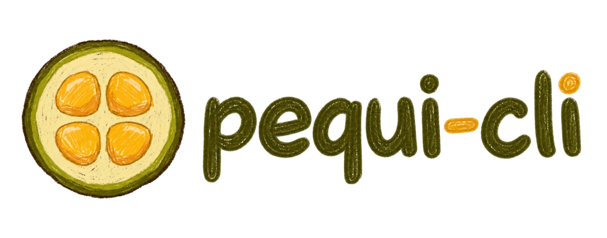
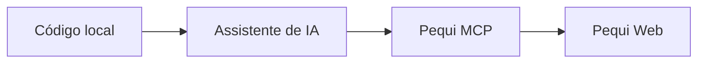

<p align="center">
  
</p>

[![npm version][npm-version-src]][npm-version-href]
[![License][license-src]][license-href]

Uma CLI e um servidor MCP para transformar código local em diagramas Mermaid e
sincronizá-los com o Pequi.

O Pequi CLI conecta um repositório ao seu projeto no Pequi. Assim, um assistente
de IA pode analisar o código, gerar um diagrama e enviá-lo ao webapp sem receber
suas credenciais da OpenAI, Anthropic ou de outro provedor.

## Recursos

- Login sem senha por e-mail e código de uso único (OTP).
- Vínculo entre um repositório local e um projeto Pequi.
- Envio, atualização, listagem e download de diagramas Mermaid.
- Proteção contra sobrescrita acidental por controle de revisão.
- Servidor MCP local compatível com clientes que suportam transporte `stdio`.
- Sessão compartilhada entre os comandos da CLI e o servidor MCP.

## Requisitos

- Node.js 20 ou mais recente.
- Uma conta em uma instância do Pequi.
- Um projeto criado nessa conta.

Confira a versão instalada:

```bash
node --version
```

## Instalação

Instale a versão mais recente publicada no npm:

```bash
npm install --global pequi-cli
```

Confirme que o comando está disponível:

```bash
pequi help
```

Para atualizar uma instalação existente:

```bash
npm install --global pequi-cli@latest
```

Você também pode executar um comando sem instalar o pacote globalmente:

```bash
npx --yes pequi-cli help
```

## Início rápido

### 1. Entre na sua conta

Informe apenas a origem da aplicação, sem páginas como `/new`. A CLI acrescenta
`/api/v1` automaticamente:

```bash
pequi login --server https://pequi.xyz
```

Se você usa outra instalação do Pequi, substitua a URL pelo endereço fornecido
pelo administrador:

```bash
pequi login --server https://pequi.sua-empresa.example
```

A CLI solicitará seu e-mail e o código de seis dígitos enviado para ele. A URL
será salva e não precisará ser repetida nos próximos comandos.

Confira a sessão:

```bash
pequi whoami
```

### 2. Vincule seu repositório

Entre na pasta do projeto cujo código será diagramado:

```bash
cd caminho/do/seu-projeto
pequi link
```

Sem argumento, o comando usa o primeiro projeto disponível na conta. Para
selecionar outro projeto, informe seu ID ou slug:

```bash
pequi link meu-projeto
```

O vínculo fica em `.pequi/project.json` dentro do repositório.

### 3. Envie um diagrama

Crie um arquivo Mermaid dentro do repositório:



Salve, por exemplo, como `docs/arquitetura.mmd` e envie:

```bash
pequi diagram push docs/arquitetura.mmd --title "Arquitetura do sistema"
```

O primeiro envio cria o diagrama. Os próximos envios do mesmo arquivo atualizam
o diagrama existente e incrementam sua revisão.

### 4. Consulte ou baixe diagramas

```bash
pequi diagram list
pequi diagram pull ID_DO_DIAGRAMA --out docs/arquitetura.mmd
```

Abra o webapp com a mesma conta. Se o diagrama ainda não estiver visível, use a
ação **Buscar diagramas no Pequi**.

## Uso com assistentes de IA

O servidor MCP é executado localmente por:

```bash
pequi mcp serve
```

Normalmente você não precisa executar esse comando manualmente. O cliente MCP o
inicia usando sua configuração.

Antes de configurar um cliente, execute `pequi login` uma vez. Execute também
`pequi link` dentro de cada repositório que desejar associar a um projeto Pequi.

### Configuração MCP genérica

Clientes que usam o formato `mcpServers` podem receber esta configuração:

```json
{
  "mcpServers": {
    "pequi": {
      "command": "pequi",
      "args": ["mcp", "serve"]
    }
  }
}
```

Se preferir não instalar o pacote globalmente, o cliente também pode baixá-lo
e executá-lo pelo npm com `npx`:

```json
{
  "mcpServers": {
    "pequi": {
      "command": "npx",
      "args": ["--yes", "pequi-cli", "mcp", "serve"]
    }
  }
}
```

O nome e o local do arquivo variam conforme o aplicativo. Depois de salvar a
configuração, reinicie completamente o cliente MCP.

Alguns clientes iniciam o servidor fora da pasta do repositório. Quando houver
uma opção de diretório de trabalho, configure-a para a raiz do projeto que
contém `.pequi/project.json`.

Se o aplicativo não encontrar `pequi`, descubra o caminho absoluto:

```bash
# macOS e Linux
command -v pequi

# Windows
where pequi
```

Use o resultado como `command` na configuração. No Windows, alguns clientes
exigem a execução por `cmd`:

```json
{
  "mcpServers": {
    "pequi": {
      "command": "cmd",
      "args": ["/c", "pequi", "mcp", "serve"]
    }
  }
}
```

### Codex CLI

Veja o comando de instalação:

```bash
pequi mcp command codex
```

Ou configure automaticamente:

```bash
pequi mcp setup codex
```

Comando equivalente:

```bash
codex mcp add pequi -- pequi mcp serve
```

### Claude Code

Veja o comando de instalação:

```bash
pequi mcp command claude
```

Ou configure automaticamente:

```bash
pequi mcp setup claude
```

Comando equivalente:

```bash
claude mcp add --transport stdio pequi -- pequi mcp serve
```

### Ferramentas MCP disponíveis

| Ferramenta | Finalidade |
| --- | --- |
| `pequi_status` | Verifica a conta autenticada e o projeto vinculado. |
| `pequi_list_diagrams` | Lista os diagramas do projeto atual. |
| `pequi_get_diagram` | Lê o conteúdo Mermaid e a revisão de um diagrama. |
| `pequi_publish_diagram` | Cria ou atualiza um diagrama no projeto Pequi. |

Exemplos de solicitações para o assistente:

- “Analise este repositório e publique no Pequi um diagrama da arquitetura.”
- “Atualize o diagrama de autenticação com base no código atual.”
- “Liste meus diagramas no Pequi e explique o diagrama de infraestrutura.”
- “Gere um fluxograma Mermaid deste módulo e salve-o no projeto vinculado.”

`pequi_publish_diagram` sincroniza um diagrama privado com o projeto
autenticado. Ele não cria automaticamente um link público.

## Comandos

| Comando | Descrição |
| --- | --- |
| `pequi login [--email EMAIL] [--server URL]` | Autentica por e-mail e OTP. |
| `pequi logout` | Encerra e remove a sessão local. |
| `pequi whoami [--json]` | Mostra a conta, a instância e o projeto atual. |
| `pequi link [ID_OU_SLUG]` | Vincula o diretório atual a um projeto. |
| `pequi diagram list [--project ID_OU_SLUG] [--json]` | Lista diagramas. |
| `pequi diagram push ARQUIVO [--title TÍTULO]` | Cria ou atualiza um Mermaid. |
| `pequi diagram pull ID [--out ARQUIVO] [--force]` | Baixa um Mermaid. |
| `pequi mcp serve` | Inicia o servidor MCP por `stdio`. |
| `pequi mcp command codex\|claude` | Exibe o comando de configuração. |
| `pequi mcp setup codex\|claude` | Configura um cliente compatível. |

Use `pequi help` para consultar o resumo no terminal.

## Sincronização e revisões

Cada arquivo enviado recebe uma associação em `.pequi/project.json`. Esse
arquivo guarda apenas IDs e revisões; ele não contém a sessão do usuário.

Quando o mesmo arquivo é enviado novamente, a CLI usa a revisão conhecida como
base. Se o diagrama tiver sido alterado no webapp desde o último envio, a
atualização é recusada para preservar o trabalho remoto. Faça o download da
revisão atual antes de decidir o que manter:

```bash
pequi diagram pull ID_DO_DIAGRAMA --out docs/arquitetura-remota.mmd
```

Por padrão, `pull` não sobrescreve um arquivo com alterações locais. Use
`--force` apenas quando quiser substituir esse conteúdo conscientemente.

## Configuração

### Arquivos

| Local | Conteúdo |
| --- | --- |
| `~/.config/pequi/config.json` | URL da instância e sessão do usuário. |
| `.pequi/project.json` | Projeto vinculado e revisões dos arquivos locais. |

Em sistemas compatíveis, o arquivo global é criado com permissão `0600`.

### Variáveis de ambiente

| Variável | Finalidade |
| --- | --- |
| `PEQUI_SERVER_URL` | Substitui a URL da API salva. |
| `PEQUI_TOKEN` | Usa uma sessão temporária sem alterar o token salvo. |
| `PEQUI_CONFIG_DIR` | Escolhe outro diretório para a configuração global. |

Variáveis de ambiente têm precedência sobre os valores dos arquivos.

## Segurança

- A CLI não lê credenciais da OpenAI, Anthropic ou de outros provedores de IA.
- O cliente de IA continua autenticado localmente em sua própria conta.
- O Pequi recebe apenas os diagramas e metadados enviados pelo usuário.
- A sessão fica na configuração local, separada do vínculo versionável do
  repositório.
- O servidor MCP é um processo local e possui as mesmas permissões do usuário
  que o executa.

Antes de versionar `.pequi/project.json`, confirme que sua equipe deseja
compartilhar o vínculo com o mesmo projeto Pequi.

## Solução de problemas

### A API respondeu com HTTP 405

Passe apenas a origem da aplicação no `--server`:

```bash
pequi login --server https://pequi.xyz
```

Não use URLs de páginas, como `https://pequi.xyz/new`. A CLI acrescenta a rota
da API automaticamente.

### Não foi possível conectar ao Pequi

- Confirme que a URL abre no navegador.
- Verifique sua conexão e as regras de proxy ou firewall.
- Execute novamente o login informando `--server`.

### O comando `pequi` não foi encontrado

Confirme a instalação com `npm install --global pequi-cli`. Em seguida, abra um
novo terminal e execute `pequi help`.

### A conta não possui um projeto

Entre no webapp, crie um projeto e execute `pequi link` novamente.

### O diagrama não apareceu no webapp

Confirme que CLI e webapp usam o mesmo e-mail e a mesma instância. Em seguida,
use **Buscar diagramas no Pequi** no painel da conta.

### Há um conflito de revisão

Outra sessão alterou o diagrama. Use `pequi diagram pull` para obter a revisão
remota antes de publicar uma nova atualização.

### O cliente MCP não encontra o servidor

- Confirme que `pequi mcp serve` inicia sem erro no terminal.
- Use um caminho absoluto no campo `command` se o cliente não herdar seu `PATH`.
- Confirme que o diretório de trabalho contém `.pequi/project.json`.
- Reinicie o cliente depois de editar a configuração MCP.

## Licença

Distribuído sob a [licença MIT](./LICENSE).

## Desenvolvimento

Instale as dependências e execute os testes:

```bash
npm install
npm test
```

Execute a CLI diretamente do código-fonte:

```bash
node bin/pequi.js help
```

O servidor MCP reserva `stdout` para mensagens JSON-RPC. Logs e mensagens de
diagnóstico devem ser enviados por `stderr`.

[npm-version-src]: https://img.shields.io/npm/v/pequi-cli?style=flat&colorA=18181B&colorB=7C8A3C
[npm-version-href]: https://www.npmjs.com/package/pequi-cli
[license-src]: https://img.shields.io/github/license/yabamiah/pequi-cli.svg?style=flat&colorA=18181B&colorB=7C8A3C
[license-href]: https://github.com/yabamiah/pequi-cli/blob/main/LICENSE
